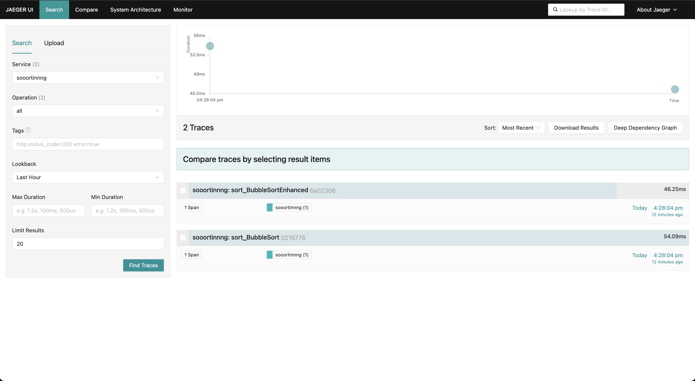

# Sort Algorithms

Este projeto implementa vários algoritmos de ordenação famosos (Bubble Sort, Bubble Sort Improved, Quick Sort e Merge Sort) utilizando o padrão de projeto **Strategy** em Ruby. A execução dos algoritmos é rastreada com **OpenTelemetry**, e os logs/traces são visualizados usando o **Jaeger**, uma ferramenta open-source de rastreamento.

## Pré-requisitos

- **Docker**: Necessário para rodar a aplicação e o Jaeger em contêineres.
- **Docker Compose**: Para orquestrar os serviços.
- **Ruby**: Apenas necessário se você quiser rodar localmente fora do Docker (versão 3.2 recomendada).
- **Bundler**: Para gerenciar as dependências Ruby (instalado com `gem install bundler`).

## Como rodar o projeto

### 1. Instale as dependências (opcional, apenas fora do Docker)

Se quiser rodar localmente sem Docker:

```bash
bundle install
```

### 2. Inicie os serviços com Docker Compose

No diretório raiz do projeto, execute:

```bash
docker-compose up --build
```

- **`--build`**: Garante que as imagens Docker sejam reconstruídas com as últimas mudanças.
- Isso inicia dois serviços:
  - `sorting_app`: A aplicação Ruby que executa os algoritmos.
  - `jaeger`: O servidor Jaeger para visualizar os traces.

### 4. Verifique a saída

- As ordenação será retornada dentro da pasta results:
  ```
  └── results
    ├── bubble_sort
    └── bubble_sort_enhanced
  ```

### 5. Abra o Jaeger

- Abra um navegador e acesse:

  ```
  http://localhost:16686
  ```

- Na interface do Jaeger:

  1. No campo **Service**, selecione `sooortinnng`.
  2. Clique em **Find Traces**.
  3. Você verá os traces com spans para cada algoritmo (ex.: `sort_BubbleSort`, `sort_QuickSort`), incluindo:
     - Tempo de execução (`execution_time_ms`).
     - Tamanho do array (`array_size`).
     - Resultado ordenado (`sorted`).

  

### 6. Pare os serviços

Quando terminar, volte ao terminal e pressione `Ctrl+C`. Para remover os contêineres:

```bash
docker-compose down
```
